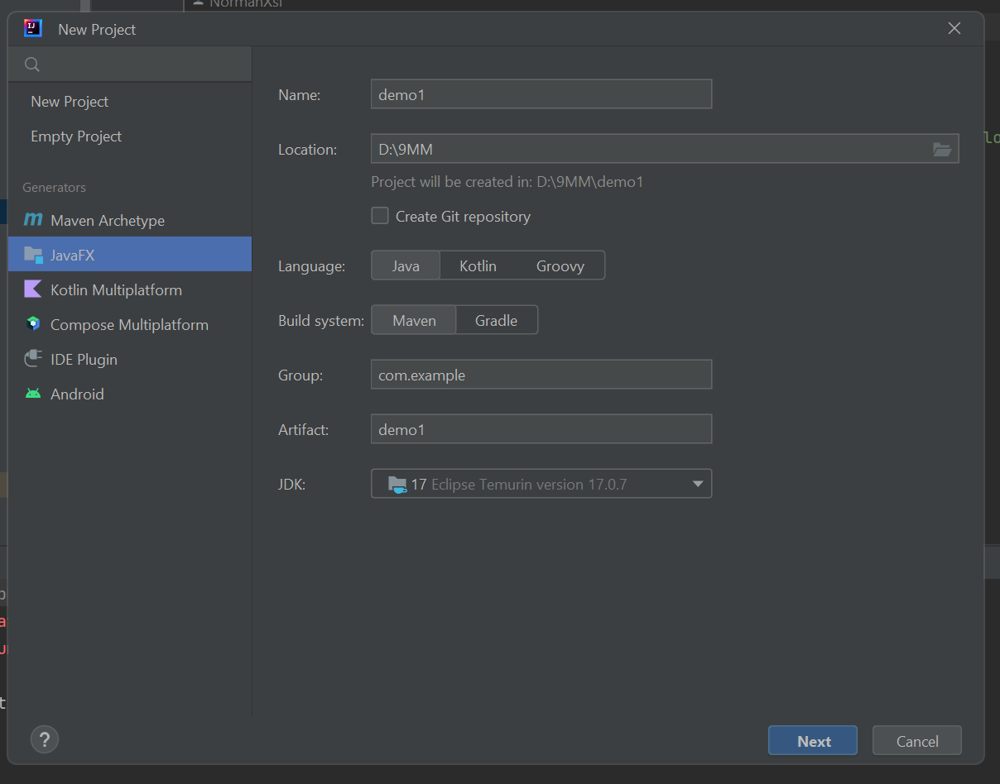
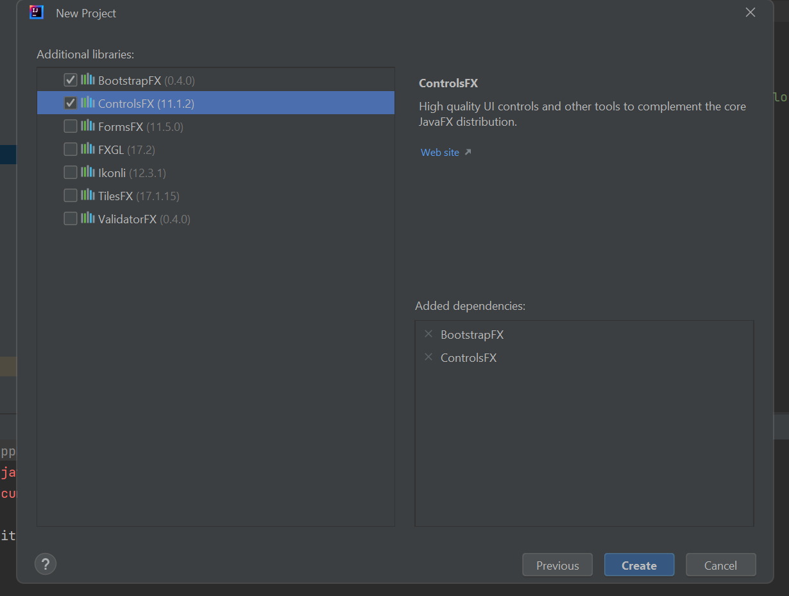
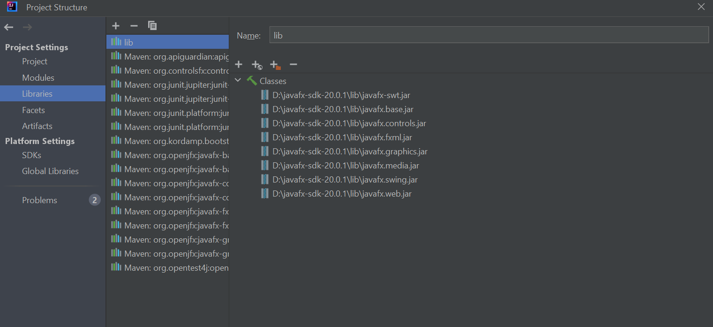
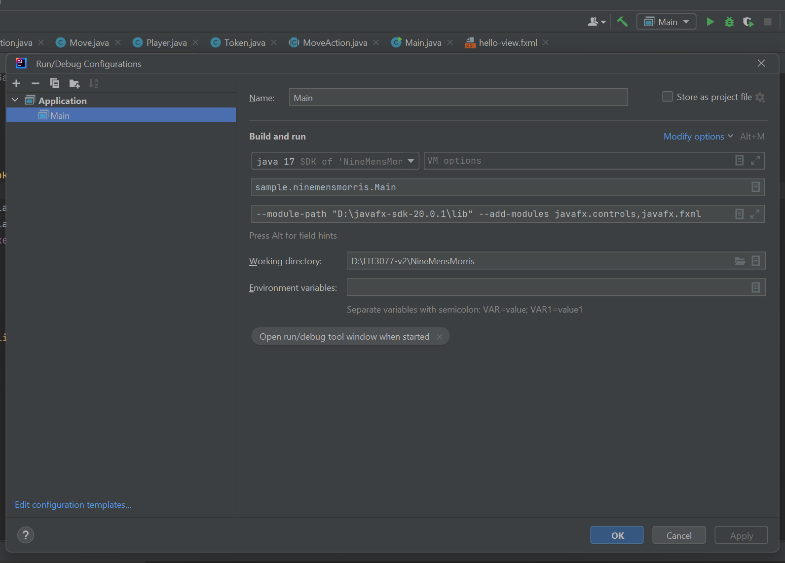

# FIT3077_project
****Please visit "FX" branch to see all the updates on the project****

We used Scene Builder to design the GUI, you may download it on:
https://gluonhq.com/products/scene-builder/

In order to run the project please download lastest version of SDK of JAVAFX from:
https://gluonhq.com/products/javafx/

1. Before clone the project from git, please start a new JavaFX project to setup local dependecies. 

2. Please make sure to tick the additional libraries:

3. When your local project is made, clone the updated project from git using HTTP link

4. When the updated project is initialised in your local directory, insert SDK to library:

5. apply the configuration as the following:

6. The project and GUI should be able to run at your local device.

## to play the game:
1. click on the token you would like to move first
2. click on the available position you would like to move token to
